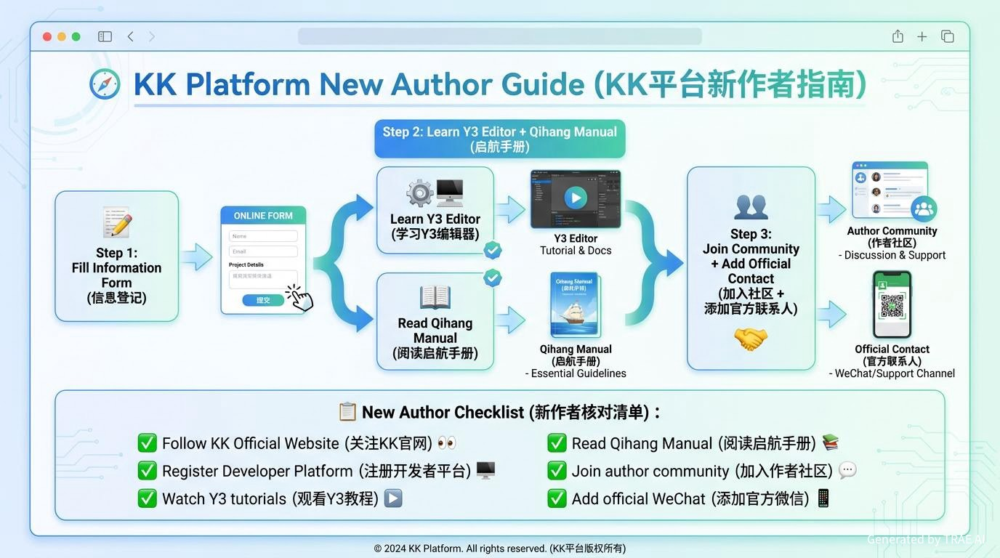

# 🎮 KK平台新作者入门指南

> **一张图带你玩转KK对战平台，从零开始制作地图！**

---



---

## 🚀 新作者成长路线图

```
┌─────────────────────────────────────────────────────────────────────────────┐
│                                                                             │
│   📝 第一步                    ⚡ 第二步                     🎯 第三步       │
│   填写信息登记                  学习编辑器                    加入社群        │
│                               ─────────                    ────────         │
│   【必做】                      【必学】                     【必做】          │
│   点击这里填写 →                 Y3编辑器教程                  添加运营微信   │
│   [信息登记入口]                + 启航手册                    获得专属帮助    │
│                                 + 运营面对面课程                                 │
│                                                                             │
└─────────────────────────────────────────────────────────────────────────────┘
```

---

## 📋 入门 checklist

### ☑️ 第一阶段：准备工作（5分钟）

- [ ] **填写信息登记** → [立即填写](https://reckfeng.feishu.cn/share/base/form/shrcnzspsykbtSVmCsiBVvKPaHg)
- [ ] 关注 KK 官方网站
- [ ] 注册开发者平台账号

### ☑️ 第二阶段：学习阶段（1-3天）

- [ ] 观看 **Y3编辑器教学视频**
- [ ] 阅读 **启航手册**（运营入门必读）
- [ ] 参加 **运营线上面对面课程**

### ☑️ 第三阶段：实践阶段（持续）

- [ ] 加入作者社群
- [ ] 添加官方运营人员微信
- [ ] 开始制作你的第一张地图

---

## 🔗 核心资源导航

| 资源类型 | 名称 | 推荐指数 | 链接 |
|:--------:|------|:--------:|------|
| 🌐 | KK官网 | ⭐⭐⭐⭐⭐ | 认准官方域名 |
| 🛠️ | 开发者平台 | ⭐⭐⭐⭐⭐ | 作者日常运营后台 |
| 📖 | 启航手册 | ⭐⭐⭐⭐⭐ | 运营入门必读 |
| 📚 | Y3开发者文档 | ⭐⭐⭐⭐⭐ | 编辑器技术教程 |

---

## 🎯 一图总结

```
                        ┌─────────────────────┐
                        │   🎮 制作地图       │
                        │   ⬇️              │
                        └────────┬──────────┘
                                 │
                    ┌────────────┼────────────┐
                    ▼                         ▼
           ┌─────────────────┐     ┌─────────────────┐
           │  📖 学技术      │     │  📈 学运营      │
           │  ──────────     │     │  ──────────     │
           │  Y3编辑器教程   │     │  启航手册      │
           │  + 教学视频     │     │  + 运营课程     │
           └─────────────────┘     └─────────────────┘
                    │                         │
                    └────────────┬────────────┘
                                 ▼
                        ┌─────────────────┐
                        │  🤝 找帮助      │
                        │  加入社群       │
                        │  添加运营微信   │
                        └─────────────────┘
```

---

## 💬 官方联系方式

| 联系方式 | 说明 |
|----------|------|
| 信息登记入口 | [点击填写](https://reckfeng.feishu.cn/share/base/form/shrcnzspsykbtSVmCsiBVvKPaHg) |
| 官方运营 | 加入社群后联系 |
| 开发者平台 | [开发者后台](https://developer.example.com) |

---

## ❓ 常见问题

**Q: 必须填写信息登记吗？**
> 是的！漏填或不填会影响官方对您的帮助和服务。

**Q: 先学技术还是先学运营？**
> 建议先学技术（Y3教程），再做运营。技术是基础！

**Q: 遇到问题找谁？**
> 加入作者社群，添加官方运营人员微信，获得一对一帮助。

---

*📅 最后更新：2026-05-29*
